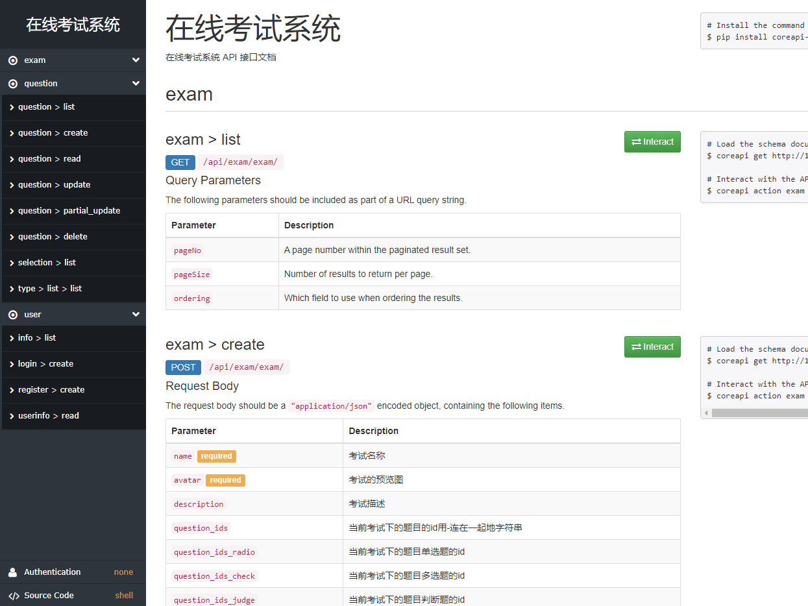
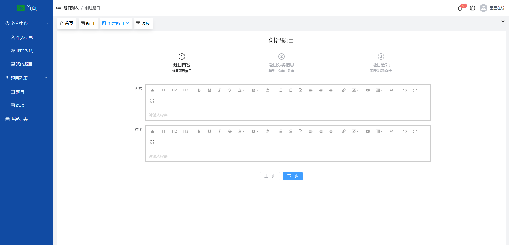
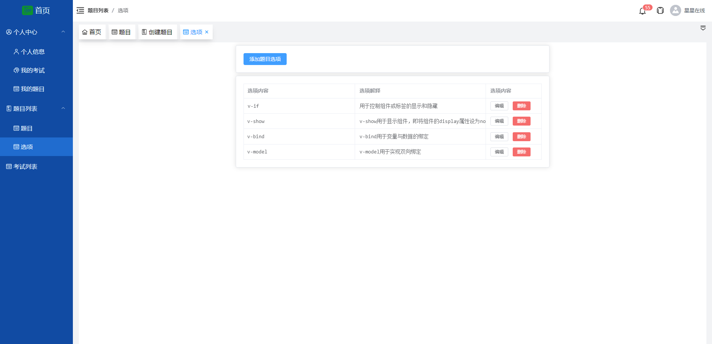
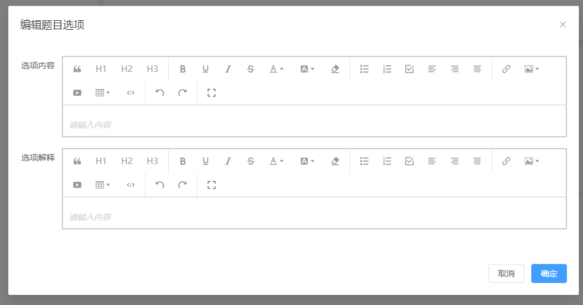

# django-vue3.2-online-exam

### 介绍
基于 Django+Vue3.2+TypeScript 的在线考试系统，在线体验：http://exam.xingxingzaixian.fun，欢迎大家提issue

### 功能简介

+ 支持单选题、多选题、判断题
+ 支持学生(student)、教师(teacher)、管理员(admin)三种角色
  + 学生：参加考试和查看我的考试
  + 教师：学生的所有权限+创建/编辑题目+创建/编辑考试
  + 管理员：教师的所有权限+管理用户

### 软件架构

> 前后端分离，前段组件化，方便二次开发；后端

+ 后端采用DjangoRestFrameWork+CoreApi+JWT校验,根据不同用户的权限返回给用户不同的数据
+ 前端采用Vue3.2+Element-Plus+TypeScript,组件化拆分，方便维护和二次开发

### 使用教程

+ 1.下载代码
  ```shell
  git clone git@github.com:xingxingzaixian/django-vue3.2-online-exam.git
  ```
+ 2.初始化环境
  
  > 安装mysql的步骤这里省略，网上的教程很多。安装好mysql后，修改settings.py中的数据库连接信息，创建好数据库。
  > 使用 pip 安装 pipenv 包
  
+ 3.启动后端
  
  > 进入 backend 目录下，执行 `pipenv install`，注意我用的是 python3.8，如果你用的是其他版本，请将 Pipfile 文件中的版本号改一下
  > 安装好依赖以后，需要初始化数据库信息，执行 `pipenv run migrate`
  > 执行完上面的安装命令后，再执行 `pipenv run dev`，就启动了后端，在浏览器端访问 http://localhost:9527/docs 即可看到后端的 API 界面

  

+ 4.启动前端
  + 进入到前端代码路径 `cd frontend`
  + 安装依赖 `yarn install`
  + 启动前端 `yarn run dev`
+ 5.部署完毕，查看效果
  
  > 打开 http://localhost:8000 或者 http://本机ip:8000 即可查看演示效果

### 功能图示

**前后端功能目前均正在重构中**。
- 考试列表


- 题目列表


- 创建题目


- 选项列表


- 编辑选项


### 功能开发中
* [x] 前端中后台框架开发
* [x] 题目列表显示界面
* [x] 选项列表显示界面
* [x] 题目新增、编辑、删除
* [x] 选项新增、编辑、删除
* [x] 考试卡片显示界面
* [x] 考试新增、编辑、删除
* [x] 封装Table和Tool组件
* [x] 封装wangEditor组件
* [x] 封装图片编辑组件
* [ ] Form表单校验
* [ ] 后端权限设计

# 更新记录
[更新日志](UPDATE.md)