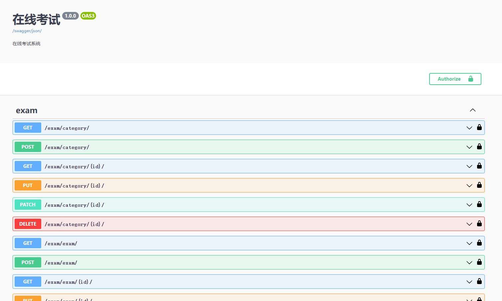

# django-vue3.2-online-exam

**有一些小伙伴找我要数据库的SQL文件，如果你看到这个项目，我默认你是会Django的，既然会Django我觉得就不应该问这个问题了，Django的数据库迁移是必须要会滴，我稍微改了一下下面的步骤，相信会Django的同学大家应该都能理解。如果你是一个纯前端的同学，不想运行后端服务器，那么也可以直接配我搭建的后台服务器地址：http://apiexam.xingxingzaixian.fun**

### 介绍
基于 Django+Vue3.2+TypeScript 的在线考试系统，在线体验：http://small_bud_star.gitee.io/django-vue3.2-online-exam，欢迎大家提issue

### 功能简介

+ 支持单选题、多选题、判断题
+ 支持学生(student)、教师(teacher)、管理员(admin)三种角色
  + 学生：参加考试和查看我的考试
  + 教师：学生的所有权限+创建/编辑题目+创建/编辑考试
  + 管理员：教师的所有权限+管理用户

### 软件架构

> 前后端分离，前段组件化，方便二次开发；后端

+ 后端采用DjangoRestFrameWork+CoreApi+JWT校验,根据不同用户的权限返回给用户不同的数据
+ 前端采用Vue3.2+Element-Plus+TypeScript,组件化拆分，方便维护和二次开发

### 使用教程

+ 1.下载代码
  ```shell
  git clone git@github.com:xingxingzaixian/django-vue3.2-online-exam.git
  ```
+ 2.初始化环境

  安装MySQL数据库，创建名为exam的数据库，并在Django的settings.py文件中配置好数据库信息。
  

+ 3.初始化Python环境
  必须先使用`pip`命令安装`pipenv`虚拟环境管理包，在`Pipfile`文件里面我配置的是`3.8.11`，如果你自己的Python版本不一样，修改一下文件里面的配置，然后执行下面的步骤。

  ```shell
  # 进入后端目录
  cd backend

  # 安装项目依赖库
  pipenv install

  # 生成数据库迁移文件
  pipenv run makemigrations

  # 执行数据库迁移，这一步会生成所有的表
  pipenv run migrate
  ```

+ 4.启动后端

  执行完上面的安装命令后，再执行 `pipenv run dev`，就启动了后端，在浏览器端访问 http://localhost:9527/docs 即可看到后端的 API 界面

  

+ 5.启动前端
  + 进入到前端代码路径 `cd frontend`
  + 安装依赖 `yarn install`
  + 启动前端 `yarn run dev`
  
+ 6.部署完毕，查看效果
  
  > 打开 http://localhost:8000 或者 http://本机ip:8000 即可查看演示效果

### 功能图示

**前后端功能目前均正在重构中**。
- 考试列表


- 题目列表


- 创建题目


- 选项列表


- 编辑选项


### 功能开发中
* [x] 前端中后台框架开发
* [x] 题目列表显示界面
* [x] 选项列表显示界面
* [x] 题目新增、编辑、删除
* [x] 选项新增、编辑、删除
* [x] 考试卡片显示界面
* [x] 考试新增、编辑、删除
* [x] 封装Table和Tool组件
* [x] 封装wangEditor组件
* [x] 封装图片编辑组件
* [x] Form表单校验
* [ ] 后端权限设计

# 更新记录
[更新日志](UPDATE.md)


# 诚邀
突然间发现自己的设计感贼差，经常为了考虑一个界面该怎么展示而头疼，诚邀有志之士加入，哪怕只提供一个灵感也好。
